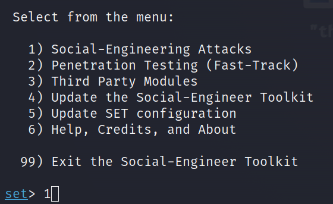
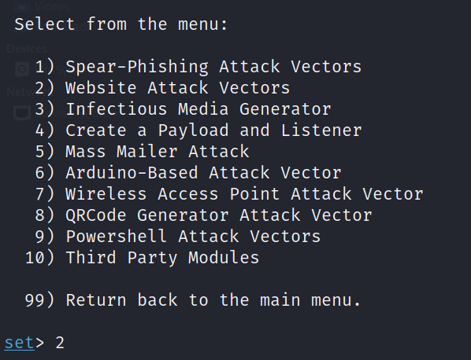
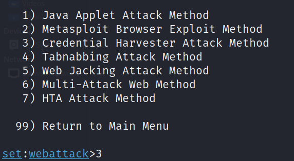
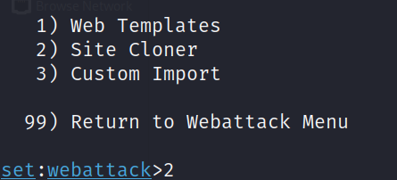
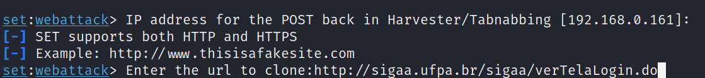
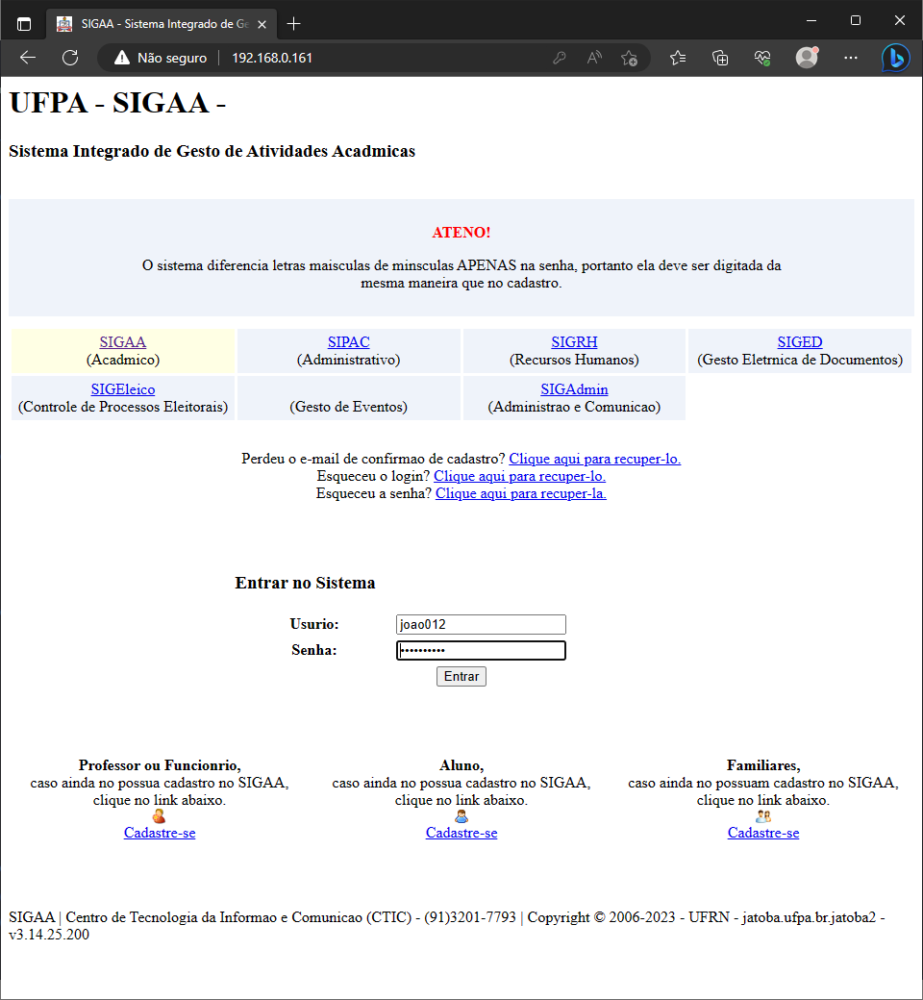
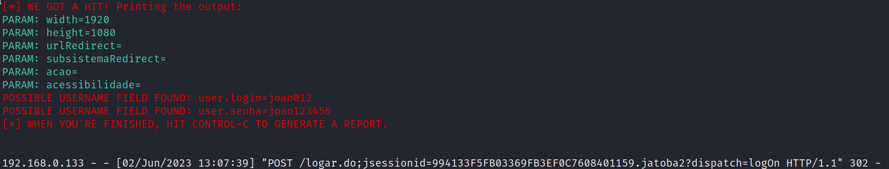

# DESAFIO-DIO: Phishing para credenciais de um site qualquer

### Ferramenta

- [setoolkit](https://github.com/trustedsec/social-engineer-toolkit)

> Social Engineering Toolkit(SET) é uma ferramenta de teste de intrusão escrito em Python destinada a gerar ataques de engenharia social, possuindo uma variedade de vetores de ataques.

### Configurando o Phishing

- Execute setoolkit e escolha o tipo de ataque: ``` Social-Engineering Attacks ```



- Em seguida, o vetor de ataque: ``` Web Site Attack Vectors ```



- Logo após, escolhemos o método de ataque: ```Credential Harvester Attack Method ```



- Por fim, como será feito o ataque: ``` Site Cloner ```



- Escolhemos a URL, no caso, será esta: ``` http://sigaa.ufpa.br/sigaa/verTelaLogin.do``` 



- O site clonado pode ser acessado atráves do endereço IP da rede local onde o serviço HTTP está rodando, neste caso, 192.168.0.161:



### Captura

- Ao tentar realizar o login na página clonada, todas requisições POST serão capturadas:


